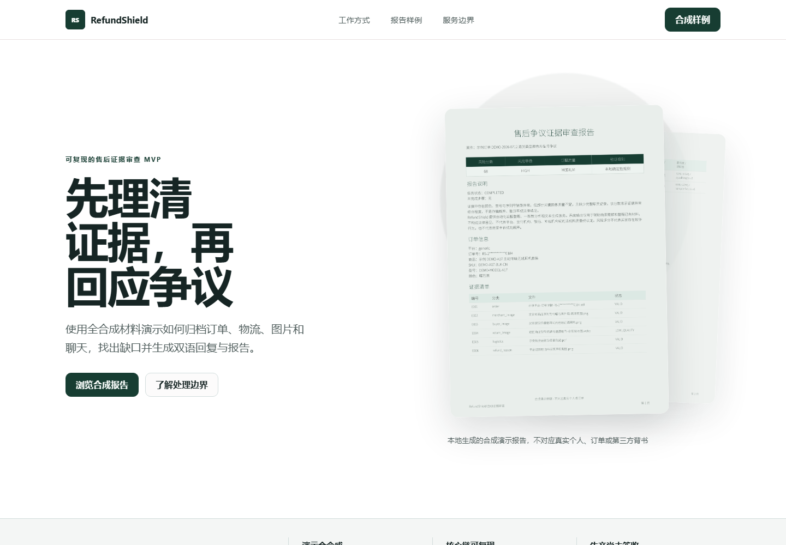
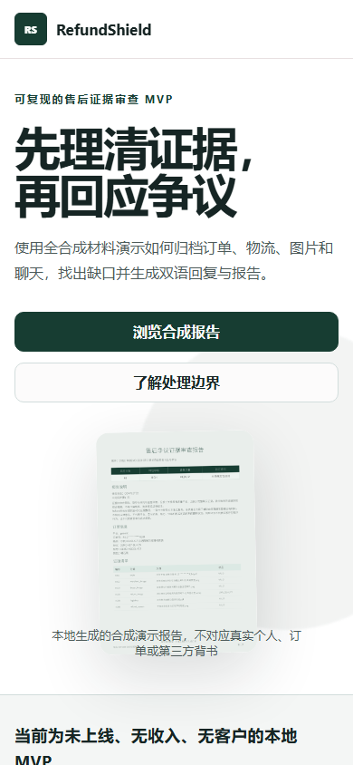
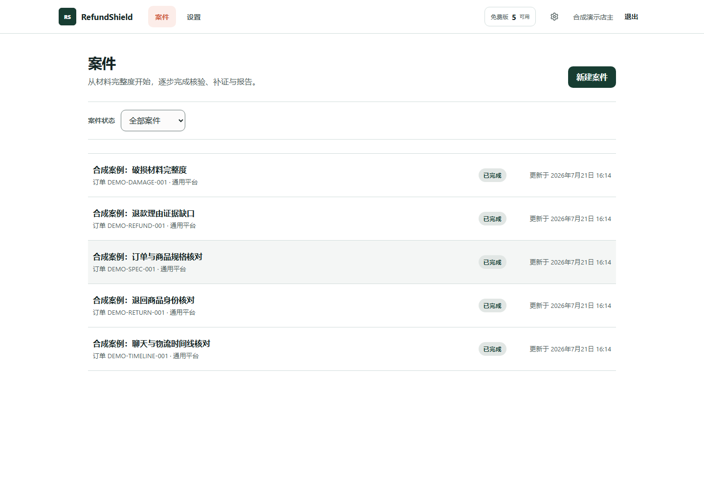
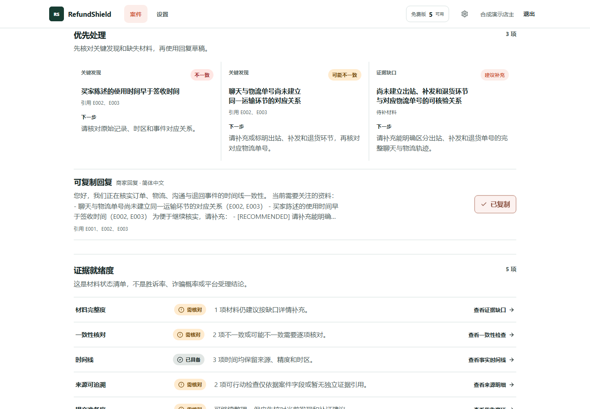
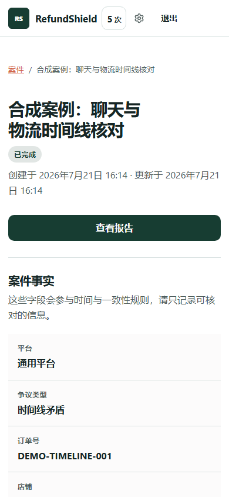
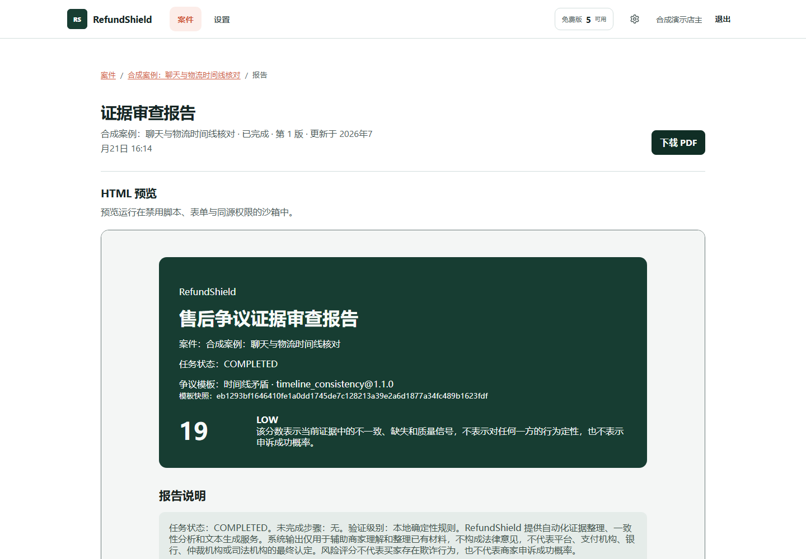

# RefundShield

RefundShield is a **pre-revenue MVP / Projects & Concepts** for organizing e-commerce after-sales dispute evidence.
It turns synthetic order, logistics, chat, and image evidence into traceable timelines, deterministic checks, evidence gaps, response drafts, and HTML/PDF reports.

[中文 README](README.md)

> This repository is a local, reproducible synthetic demonstration. It is not a live production SaaS.

## Current Facts

| Item | Status |
| --- | --- |
| Annual revenue | 0 |
| Annual profit | 0 |
| Paying customers | 0 |
| Public production deployment | No |
| Demo data | Fully synthetic |
| Release status | `release_eligible=false` |
| Stage | Pre-revenue MVP |

## Product Preview

### Workspace

### Workspace and case analysis

### Report output

## Core Capabilities

- Evidence IDs, source labels, and original-file fingerprints
- Order, product, chat, logistics, and usage timelines
- Deterministic rules, evidence-gap detection, and follow-up suggestions
- Chinese/English response drafts
- HTML and PDF reports
- Five dispute-template synthetic demo cases
- A reproducible local demo seed for buyer review

## Handoff Package

The private handoff repository contains the source code, tests, migrations, locked dependencies, deployment notes, technical documentation, license inventory, and synthetic demo assets:

**[RefundShield MVP Handoff](https://github.com/Lxsky-i/refundshield-mvp-handoff)**

The handoff package excludes customer data, secrets, third-party accounts, production databases, and non-transferable provider contracts.

## Limitations and Boundaries

- The system does not determine whether a buyer committed fraud, provide legal advice, or guarantee a dispute outcome.
- Real PostgreSQL, AI/OCR/visual providers, production services, PITR, payments, and public deployment are outside the current demo claim.
- Ownership and licensing for the name, brand, media, and third-party dependencies follow the inventories and formal agreement in the handoff package.

## Contact and Review

For source-code review or a one-time handoff discussion, contact the developer through the GitHub profile. Confirm the demo scope, transfer inventory, restricted source review, and formal agreement terms before access is granted.
